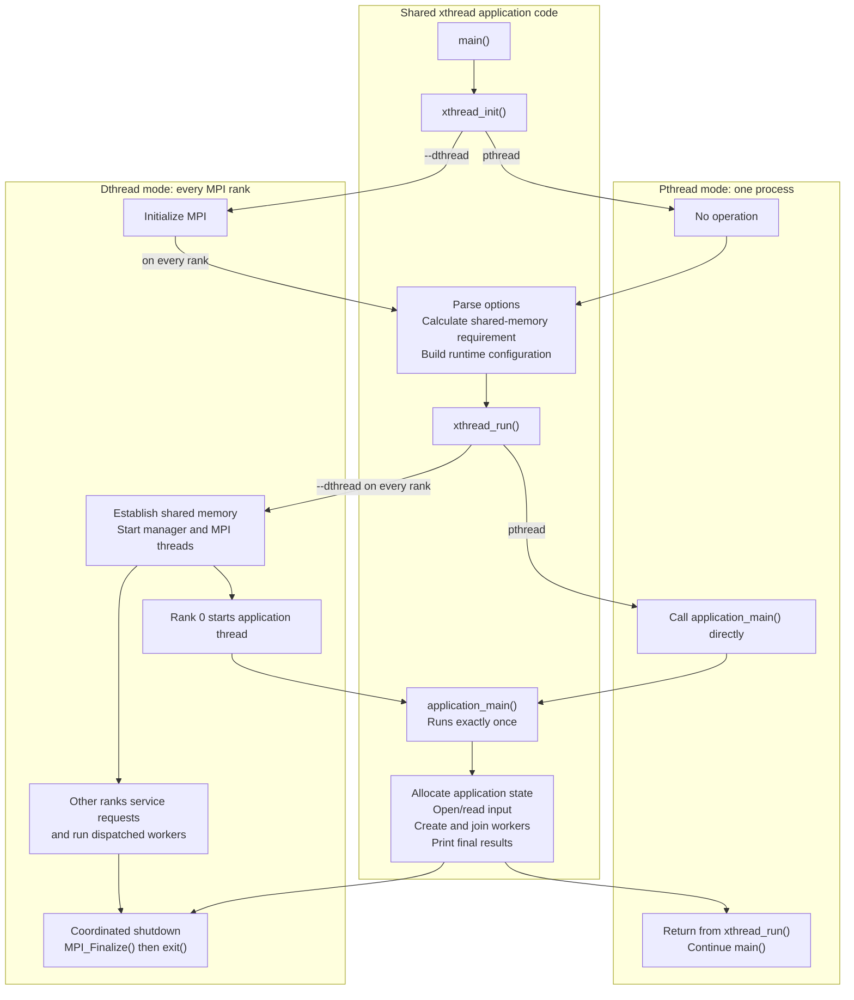

# Porting pthreads to xthreads

Pthreads run in one process and share ordinary pointers. Dthreads may run in
different MPI processes, so shared data needs shared-memory references and each
possible worker function needs a dispatch entry.

Xthreads provides one interface for both. A program runs with pthreads by
default and with dthreads when given `--dthread`. Xthreads builds the dthread
dispatch table and accounts for dthread's internal shared-memory overhead.

## Execution flow



The setup between `xthread_init()` and `xthread_run()` executes once in
pthread mode and once per MPI rank in dthread mode. `application_main()`
executes exactly once in either mode. In pthread mode `xthread_run()` returns;
in dthread mode each rank eventually exits from inside `xthread_run()`.

## Porting checklist

1. Replace `#include <pthread.h>` with:

   ```c
   #include <dthread/xthread.h>
   ```

2. Call `xthread_init(&argc, &argv)` before parsing arguments. It removes
   `--dthread` from `argv`.

3. Replace pthread types and calls with their xthread equivalents. A simple
   search-and-replace of `pthread` with `xthread` is a useful starting point.
   Compile and run the program without `--dthread` to find any pthread calls
   that do not yet have xthread equivalents. Pthread mode should still work;
   dthread mode is not expected to work yet.

4. Create a new function named `application_main()`:

   ```c
   static int application_main(int argc, char **argv)
   {
       /* Application execution will move here. */
   }
   ```

   Keep argument parsing in `main()`. Move the part of `main()` that allocates
   data, creates threads, joins them, and cleans up into `application_main()`.
   In dthread mode this function is the initial application thread on rank
   zero.

5. Allocate anything worker threads may access with `xthread_calloc()` or
   `xthread_malloc()`. Release it with `xthread_free()`.

6. Replace pointers inside thread arguments with `xthread_ref_t`. Convert each
   pointer before creating threads and convert it back inside the worker:

   ```c
   xthread_ptr_to_ref(array, array_bytes, &arg.array_ref);
   int *array = xthread_ref_to_ptr(&arg->array_ref, array_bytes);
   ```

7. List every worker function that may be passed to `xthread_create()`:

   ```c
   static const xthread_entry_t entries[] = {
       { "worker", worker },
   };
   ```

   Do not list `application_main`; xthreads creates that special first entry.

8. Add up the maximum bytes the application may allocate with xthreads and
   create a shared-memory source:

   ```c
   xthread_shmsrc_file(&shmsrc, "/tmp/my_program.shm", application_bytes);
   ```

9. Create the configuration. `max_threads` includes `application_main`, so it
   is normally the maximum simultaneous worker count plus one.

   ```c
   xthread_config_t config = {
       .entries = entries,
       .entry_count = sizeof(entries) / sizeof(entries[0]),
       .shmsrcs = &shmsrc,
       .shmsrc_count = 1,
       .max_threads = num_threads + 1,
   };
   ```

10. End `main()` with:

    ```c
    return xthread_run(&config, application_main, argc, argv);
    ```

Run with pthreads:

```sh
./my_program --numthreads 4
```

Run with dthreads:

```sh
mpiexec -n 2 ./my_program --dthread --numthreads 4
```

See [`test/hello_xthread.c`](test/hello_xthread.c) for a complete example.
